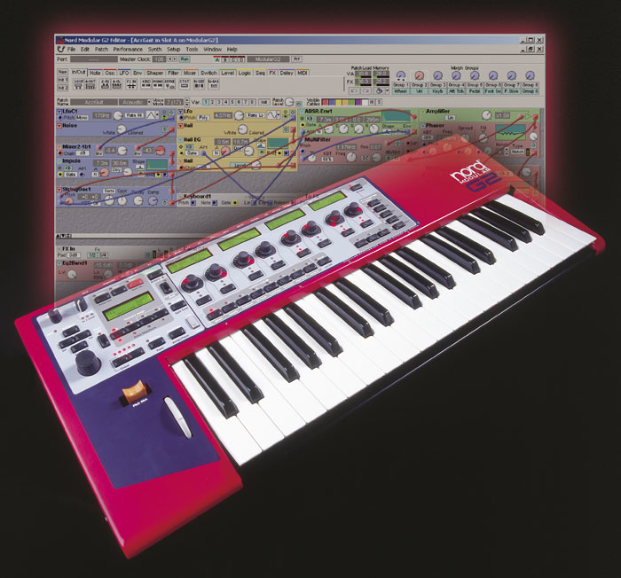
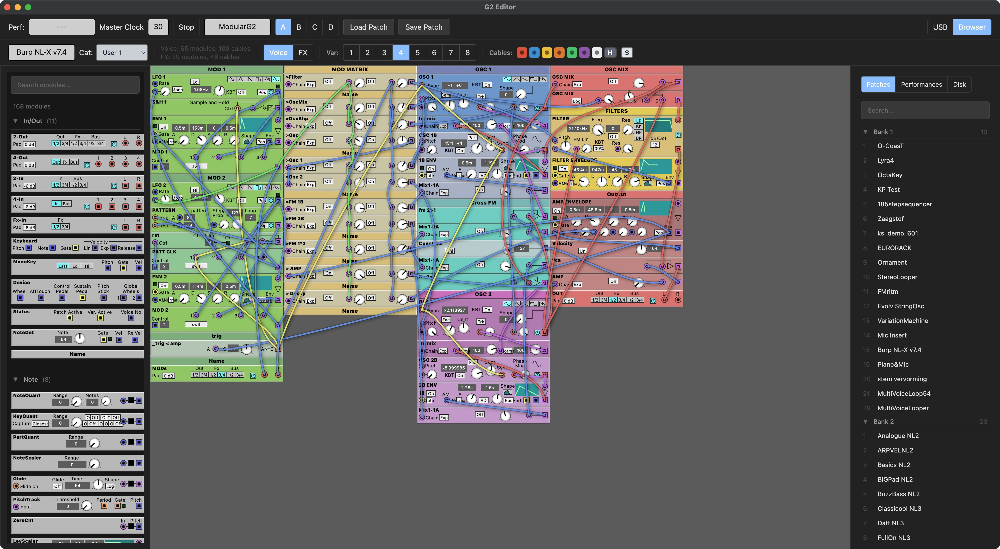
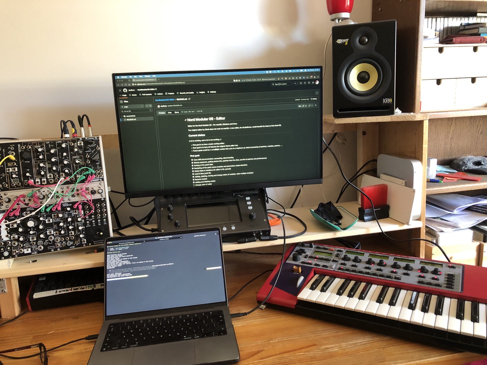

# Nord Modular G2 - Editor

Editor for the Nord Modular G2 - For macOS, Windows and Linux.

The original editor by Clavia does not work on macOS. A new editor, for all platforms, would benefit the future of the Nord G2.

## Current status

A lot is working, and a lot is not working ;-)

- First goal is to have a basic working editor.
- Next goal is to have all features the original Clavia editor has.
- Future goals could be: A small/light version that runs on a raspberry pi, batch processing of patches, modules, params, ... .

### Screenshots of current status

30 april 2026

Video: 

27 april 2026:

### First goal:

- [x] Core USB Communication: connecting, disconnecting
- [x] Startup sequence, getting device info, patches from the slots, and list of patches and performances
- [x] Parsing of the patch data
- [x] Rendering of the patch (some modules and parameters needs attention)
- [x] Switch Slots & Variations (in editor & G2, synced)
- [x] Load & Save pch2 file
- [x] Adding, deleting, moving and change colors of modules. (also multiple modules)
- [x] Rename module
- [x] Adding and deleting cables
- [ ] Change color of cable
- [x] Watch params change in editor, while changed on G2 - not tested with all params
- [x] Change params in editor and sync to G2 - not tested with all params
- [ ] Switching perf/patch mode
- [ ] Undo/Redo
- [ ] Update Led's
- [ ] Update VU meters
- [ ] Update CPU
- [ ] Editing synth settings
- [ ] Editing performance settings
- [ ] Editing patch settings
- [ ] ...
- [ ] Midi CC's
- [ ] Morphs
- [ ] Parameter Pages
- [ ] ...

## Tech goals and stack

- An editor for multiple platforms, at least macOS, Windows and if possible Linux.
- Using tech that is widely available and used by many developers.

This editor is build with electronjs, with TypeScript and VueJS.
It uses a C++ CLI tool to handle the USB communication. Which will be part of the build.

## How to contribute

Coded and tested by me on M1 apple macOS 15.7.3 and an expanded Nord Modular G2.
With some help from coding agents (claude & opencode) on a tight budget.

While I did not publish the code and builds yet, feel free to contact me if you want to help.

You could contribute:

- Developing:
  - Improving the USB communication part (C++ and some node.js)
  - Rendering the modules and parameters, not all modules/params are rendering properly.
  - UX improvements, menu, key commands, mouse commands, all the edit flows
  - Overal look & feel of the app.
  - ...
  - Adding features towards a complete basic editor
- Testing on your hardware.
- If you have any other ideas how to contribute (apart from requesting features you can't develop yourself or are beyond a working basic editor) feel free to contact me.
- If you can't contribute whatsoever, but realy wan't to support this editor and appreciate the investment in time and subscriptions I make for this, consider a donation (contact me).

### Acknowledgement

A lot of the code is based on work of others from the Nord G2 community at https://electro-music.com, specialy the Delphi Editor by bverhue: https://www.bverhue.nl/g2dev/ and the patchviewer by ian-s: https://electro-music.com/patchviewer/. But also the g2ools from qfingers: https://electro-music.com/forum/viewtopic.php?t=15405.

#### My development setup

