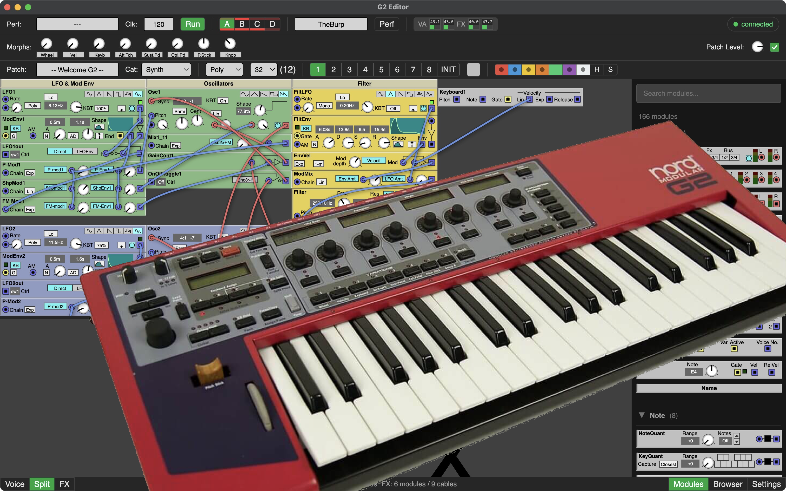

# Nord Modular G2 - Editor

Editor for the Nord Modular G2 - For macOS, Windows and (later) Linux.

The original editor by Clavia does not work on macOS. A new editor, for all platforms, would benefit the future of the Nord G2.

## Current status

A lot is working, and a lot is not working ;-)

- First goal is to have a basic working editor.
- Next goal is to have all features the original Clavia editor has.
- Future goals could be: A small/light version that runs on a raspberry pi, batch processing, midi messages via USB, ...

Video of first proof of concept (30 april 2026):

## Download & Run

Download the latest version from the [Releases page](https://github.com/JanBurp/Nord-Modular-G2---Editor/releases/latest).

| Platform | File to download |
|---|---|
| macOS Apple Silicon (M1/M2/M3/M4) | `G2 Editor-*-arm64.dmg` |
| macOS Intel | `G2 Editor-*-x64.dmg` |
| Windows | `G2 Editor Setup *.exe` |

### macOS
1. Open the `.dmg` and drag **G2 Editor** to your Applications folder.
2. On first launch macOS may block the app because it is not signed. Right-click (or Control-click) the app icon and choose **Open**, then confirm.

### Windows
Run the `.exe` installer and follow the steps.

### Help
See the [help file](../doc/help.md) for keyboard shortcuts, module editing, cabling, and more.

## How to contribute

You could contribute:

- Developing
- Testing on your hardware (see these [testing guidelines](testing.md))
- If you have any other ideas how to contribute (apart from requesting features you can't develop yourself or are beyond the goals i mentioned below) feel free to contact me.
- If you can't contribute whatsoever, but realy wan't to support this editor and appreciate the investment in time and subscriptions I make for this, consider a [donation](https://www.paypal.com/donate/?hosted_button_id=UZE943PYKY5S6). See donate button at the bottom of this page.

## Roadmap:

### First Goal - core:

- [x] Core USB Communication: connecting, disconnecting
- [x] Startup sequence, getting device info, patches from the slots, and list of patches and performances
- [x] Parsing of the patch data
- [x] Rendering of the patch (some modules and parameters needs attention)
- [x] Switch Slots & Variations (in editor & G2, synced)
- [x] Load & Save pch2 file
- [x] Load patch from synth
- [x] Adding, deleting, moving and change colors of modules. (also multiple modules)
- [x] Rename module
- [x] Adding and deleting cables
- [x] Change color of cable
- [x] Watch params change in editor, while changed on G2 - not tested with all params
- [x] Change params in editor and sync to G2 - not tested with all params
- [x] Switching perf/patch mode
- [x] Update Led's
- [x] Update VU meters
- [x] Update CPU
- [x] Editing performance / patch name
- [x] Starting/stopping Clock
- [x] Change Clock Speed
- [x] Loading performances (file/synth)
- [x] Change voice mode/count
- [x] Editing patch settings
- [x] Editing performance settings
- [x] Editing synth settings
- [x] Use cursor keys to move between modules and params
- [x] Use cursor keys to edit params
- [x] Help (modules)

### Second Goal - basics - (except Help, Patch Mutator/Adjuster etc.):

- [ ] Undo/Redo
- [ ] Modules: some graphs missing, some graphics missing, change some mode switches.
- [x] Show Morphs
- [ ] Change Morphs on params
- [ ] Midi CC's on params
- [ ] Parameter Pages
- [ ] ...

### Third goal - Beyond the basics:

- [ ] Patch Adjuster
- [ ] Patch Mutator (if possible)
- [ ] Editing names with search/replace
- [ ] ...

## Disclaimer

Use this editor at your own risk. I cannot be held responsible in any way for any damage, data loss, or issues that may arise from its use.

## Acknowledgement

A lot of the code is based on work of others from the Nord G2 community at [electro-music.com](https://electro-music.com), especially the [Delphi Editor by bverhue](https://www.bverhue.nl/g2dev/) and the [patchviewer by ian-s](https://electro-music.com/patchviewer/). But also the [g2ools by qfingers](https://electro-music.com/forum/viewtopic.php?t=15405).

### My development setup

Coded and tested by me on M1 apple macOS 15.7.3 and an expanded Nord Modular G2.
With some help from coding agents (claude & opencode) on a tight budget.

## Donate

Although i'm not in it for making money with this editor, donations will help with the development in a few ways:
- Subscriptions to coding agents which speeds up development a lot. (Now i use Claude Code & Opencode, but i'm open for good quality agents that are more friendly).
- If donations grow substantial i may buy myself a second hand Nord G2 Engine for testing purposes.

